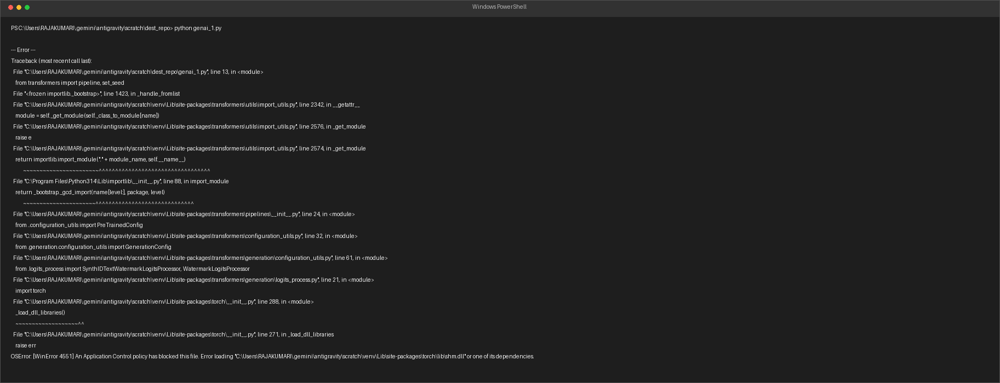
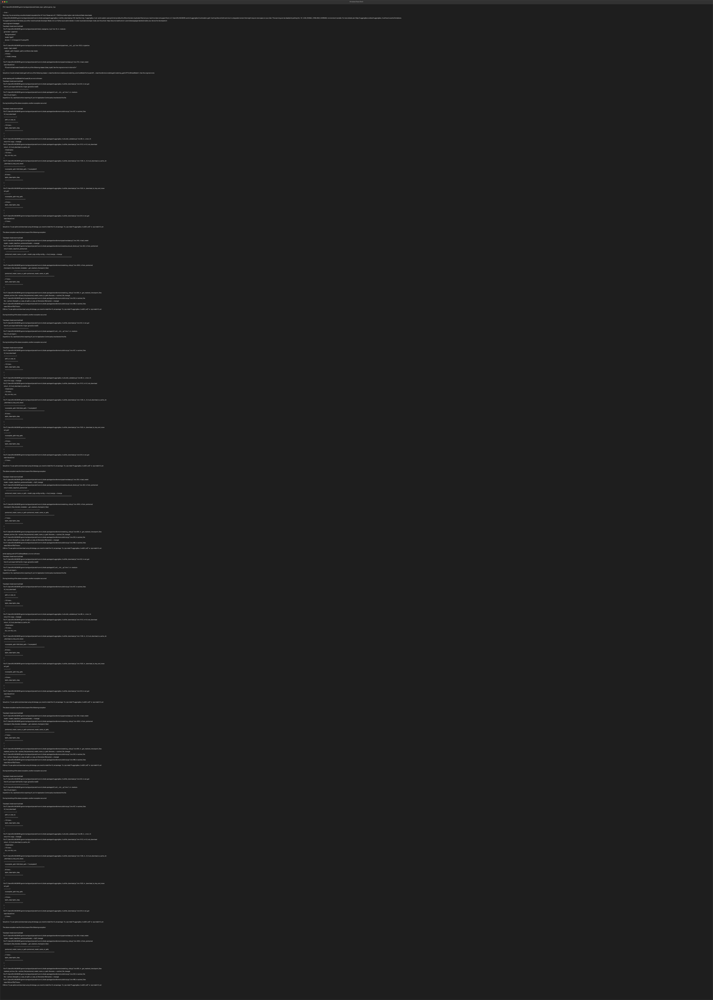
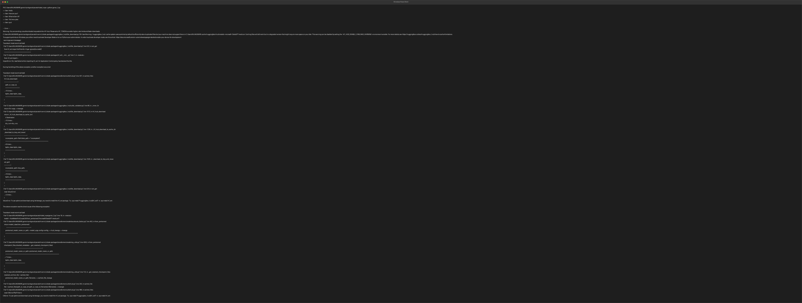
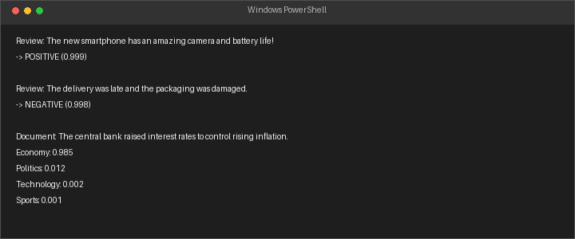

# Generative AI and LLM Lab

This repository contains the complete implementation and execution logs of all 12 experiments for the **Generative AI and LLM Lab**. Each experiment is fully documented, with executed cell outputs in notebooks and high-resolution terminal screenshots for standalone Python scripts.

---

## Experiment Directory

| # | Program / Notebook | Description | Output Verification |
|---|--------------------|-------------|---------------------|
| 1 | [genai_1.py](./genai_1.py) | **Text Generation**: Generates coherent text based on a prompt using the GPT-2 model. | [Console Screenshot](./outputs/genai_1_screenshot.png) |
| 2 | [genai_2.py](./genai_2.py) | **Prompt Engineering**: Demonstrates Zero-shot, Few-shot, and Chain-of-Thought (CoT) prompting techniques. | [Console Screenshot](./outputs/genai_2_screenshot.png) |
| 3 | [genai_3.py](./genai_3.py) | **Conversational Chatbot**: Implements a conversational loop utilizing DialoGPT. | [Console Screenshot](./outputs/genai_3_screenshot.png) |
| 4 | [genai_4.py](./genai_4.py) | **Google Colab Intro**: Interactive Google Colab workspace and AI features helper. | [Console Screenshot](./outputs/genai_4_screenshot.png) |
| 5 | [genai_5.ipynb](./genai_5.ipynb) | **Sentiment Analysis & Document Classification**: Uses pre-trained Pipelines to classify movie reviews and documents. | [Classification Output](./outputs/genai_5_screenshot.png) |
| 6 | [genai_6.ipynb](./genai_6.ipynb) | **Retrieval-Augmented Generation (RAG)**: Integrates FAISS index search and Flan-T5 text generation for knowledge retrieval. | *Rendered in Notebook* |
| 7 | [genai_7.ipynb](./genai_7.ipynb) | **Code Generation**: Automates code synthesis and bug-fixing using Salesforce Codegen. | *Rendered in Notebook* |
| 8 | [genai_8.ipynb](./genai_8.ipynb) | **Image Generation**: Synthesizes custom digital art images using Stable Diffusion v1.5. | *Generated Image* [generated_city.png](./generated_city.png) |
| 9 | [gen_ai_9.ipynb](./gen_ai_9.ipynb) | **Image Captioning & VQA**: Analyzes images, generates descriptive captions, and performs Visual Question Answering using BLIP. | *Rendered in Notebook* |
| 10 | [genai_10.ipynb](./genai_10.ipynb) | **Fine-Tuning LLM**: Fine-tunes a DistilBERT classifier on the IMDB sentiment dataset and saves the model. | *Rendered in Notebook* |
| 11 | [gen_ai_11.ipynb](./gen_ai_11.ipynb) | **Multimodal Content Generation**: Combines text generation (Flan-T5), image synthesis (Stable Diffusion), and audio narration (gTTS). | [content_image.png](./content_image.png) / [content_audio.mp3](./content_audio.mp3) |
| 12 | [genai_12.ipynb](./genai_12.ipynb) | **Model Evaluation**: Deploys a Gradio text summarization app and evaluates outputs using ROUGE metrics. | *Rendered in Notebook* |

---

## Detailed Execution Screenshots

### 1. Text Generation (genai_1.py)
Generates text completions using a pre-trained GPT-2 model.


### 2. Prompt Engineering (genai_2.py)
Compares Zero-shot, Few-shot, and Chain-of-Thought prompt performance on reasoning tasks.


### 3. Conversational Chatbot (genai_3.py)
Simulates an interactive chat session using DialoGPT.


### 4. Sentiment Analysis (genai_5.ipynb)
Performs sequence classification and zero-shot categorization.


---

## Running Locally

To run these experiments on your own machine:

1. Clone the repository:
   ```bash
   git clone https://github.com/Rajakumari208/GenAI_and_LLM_Lab.git
   cd GenAI_and_LLM_Lab
   ```

2. Create a virtual environment and install dependencies:
   ```bash
   python -m venv venv
   source venv/bin/activate  # On Windows, use `venv\Scripts\activate`
   pip install -r requirements.txt
   ```

3. Run python scripts directly:
   ```bash
   python genai_1.py
   ```

4. Or open Jupyter to run the notebooks:
   ```bash
   jupyter notebook
   ```
